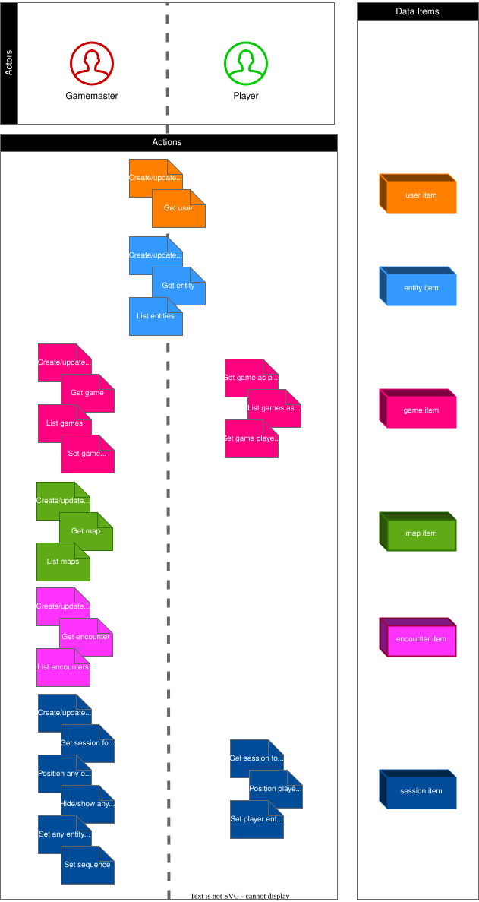
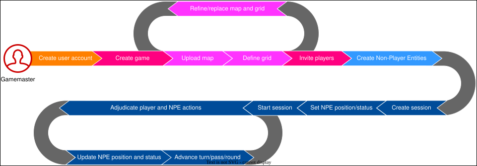
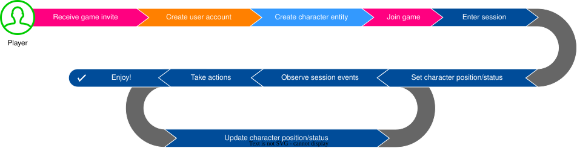
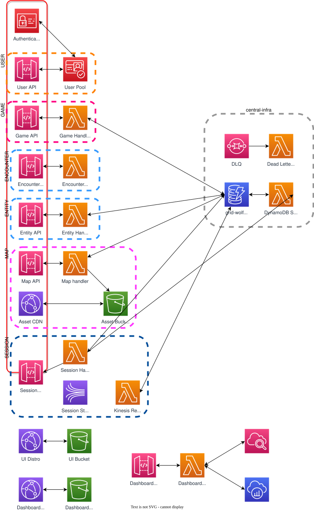

# Architecture

## Overview

The goal of `grid-wolf` is to provide participants in table-top role playing games (TTRPG) with
a way to visualize and track game scenarios in real-time over the internet. The application
emphasizes the following aspects:

- **Accessibility**: Software is *perceivable* through various senses, *operable* with assistive
technologies, *understandable* via clear instructions, information sets and navigation, and
*robustly* compatible with different devices and browsers.
- **Performance**: Systems respond quickly to user inputs even under high application loads,
leverage strategies to ensure usability in circumstances with poor network connectivity, and are
highly-tested to ensure reliability.
- **Ease-of-Use**: Interfaces are intuitive and flexible, requiring minimum user inputs to achieve
desired goals.
- **Availability**: Architecture relies on modern cloud-based technologies to maximize reliability,
provide redundancy, and eliminate maintenance down-times.
- **Maintainability**: Application components feature built-in metrics and alarms, are discrete and
of minimal complexity, and manual interventions are nearly eliminated.

### Scenarios

1. 

## User Actions

    

## User Journeys

*User journeys* describe the sequence of steps a user takes to accomplish a high-level goal within
the application.  These steps are oriented around a particular scenario, and do not provide
in-depth details on how each step is accomplished.

&nbsp;

    

*Gamemaster journey: Game creation and successful session execution*

&nbsp;
&nbsp;
&nbsp;

    

*Player journey: Joining and participating in a successful gaming session*

## High Level System Design

    

Each application component consists of a distinct micro-app included in this repository.  For details on the function of each micro-app, refer to the documentation available in each package:

- [game](../game/README.md)
