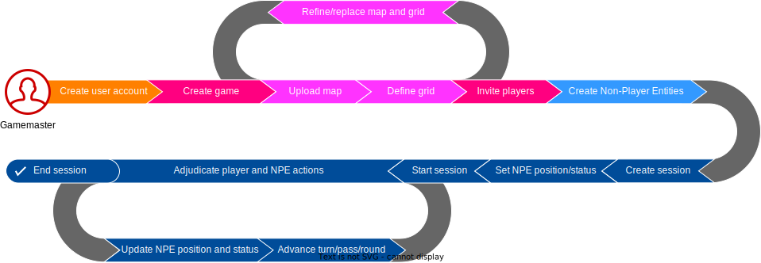
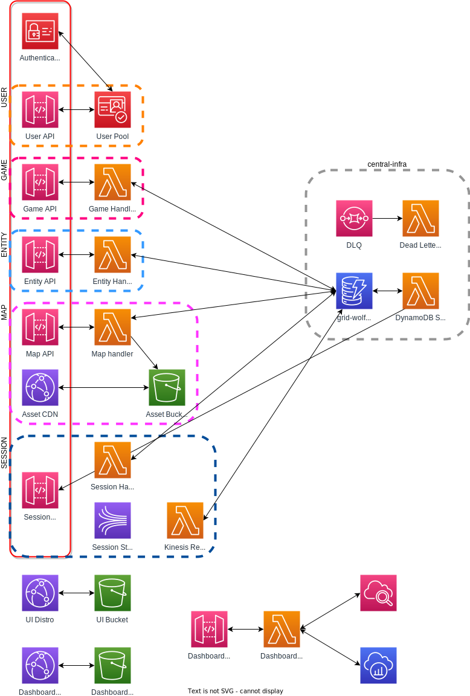

# Architecture

## User Actions

    

## User Journeys

*User journeys* describe the sequence of steps a user takes to accomplish a high-level goal within
the application.  These steps are oriented around a particular scenario, and do not provide
in-depth details on how each step is accomplished.

&nbsp;

    

*Gamemaster journey: Game creation and successful session execution*

&nbsp;
&nbsp;
&nbsp;

    

*Player journey: Joining and participating in a successful gaming session*

## High Level System Design

    

