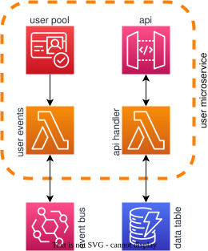
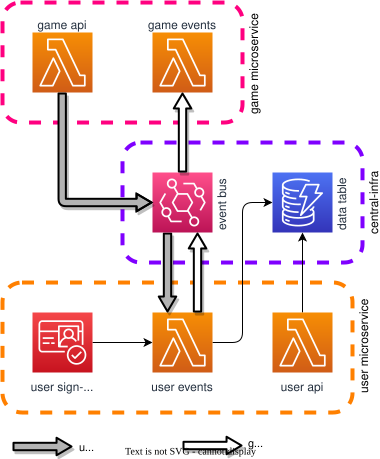

# @grid-wolf/user

The **user** micro-application manages infrastructure and code for user management throughout the **grid-wolf** application. The app leverages AWS Cognito for user sign-up and sign-in, and also provides tools for managing game invitations between game leaders and players.

## Infrastructure

- **DynamoDB table**: Managed by the [central-infra package](../central-infra/README.md)
- **EventBridge Event Bus**: Managed by the [central-infra package](../central-infra/README.md)

The following resources are managed within this micro-app, some of which leverage a SingleHandlerApi construct provided by **stepinto-aws-tools**:

- **ApiGateway REST API** and related resources such as usage plans, API keys, stages, deployments and logging (included in the SingleHandlerApi construct)
- **API Lambda function** for handling calls to the API (included in the SingleHandlerApi construct)
- **Events Lambda function** for processing events from the central event bus
- **IAM Roles and Policies** which provide required permissions for the application to function
- **Cognito User Pool and App Client** for user authentication, authorization and management

<center>
    
</center>

## Data Flow

<center>
    
</center>

### Models

```typescript
interface PlayerGameDTO {
  playerId: string;
  gameId: string;
  email: string;
  participationState: ParticipationState;
  timestamp: number;
}
```

`PlayerGameDTO` is used to track the relationship between users as game participants and individual games.  Creation of these items in DynamoDB is triggered by the creation of a new `game` by a game leader which includes a list of player email addresses.  For players who do not already have an account in the system, `PlayerGameDTO` is initially created using the player's email address in the `playerId` field.

When players sign up and confirm their email address, a user ID is created in Cognito, and an event is dispatched which triggers the replacement of the original `PlayerGameDTO` item with one which uses the new user ID in the `playerId` field.  In the case that a player already had an account, this step is not necessary and the event will be disregarded.
