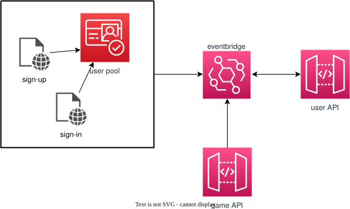

# @grid-wolf/user

The **user** micro-application manages infrastructure and code for user management throughout the **grid-wolf** application. The app leverages AWS Cognito for user sign-up and sign-in, and also provides tools for managing game invitations between game leaders and players.

## Infrastructure

- **DynamoDB table**: Managed by the [central-infra package](../central-infra/README.md)

The following resources are managed within this micro-app, some of which leverage a SingleHandlerApi construct provided by **stepinto-aws-tools**:

- **ApiGateway REST API** and related resources such as usage plans, API keys, stages, deployments and logging (included in the SingleHandlerApi construct)
- **Lambda function** for handling calls to the API (included in the SingleHandlerApi construct)
- **IAM Roles and Policies** which provide required permissions for the application to function
- **SNS topic and associated lambda** which allow for adding player data to the data table on game creation

## Data Flow

Here we have the cognito stuff.

Also there is an API for providing limited user information for specific purposes, such as a list of games to which a user has been invited (PlayerGame). Also there is a service to handle SNS messages about new games, so PlayerGame entries are automatically created, and then users can provide their response to the invite. Also there is something about getting invite response status based on userId and gameID (batch dynamo call) so game leaders can check on status invites.

Probably more.
